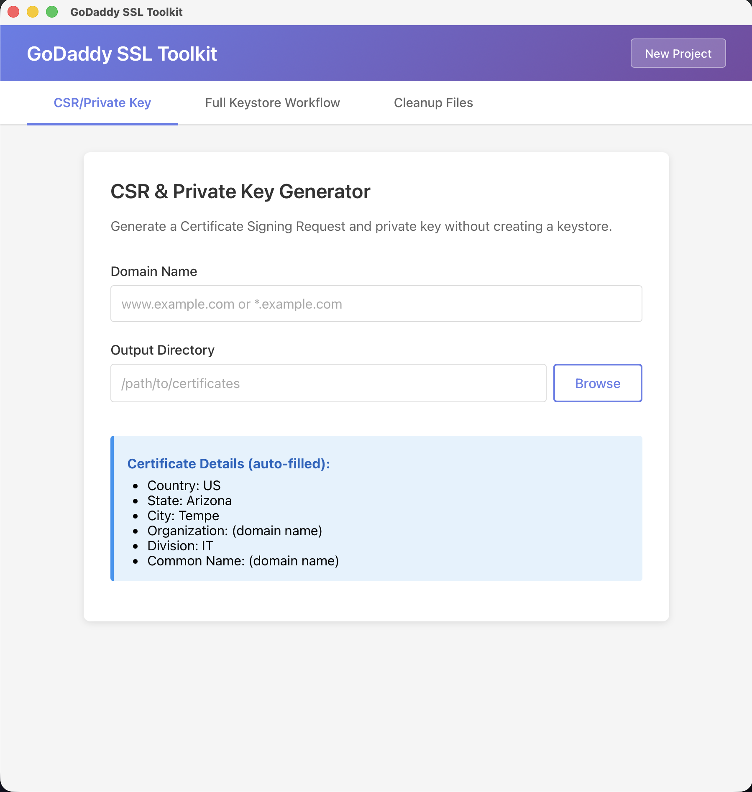

# GoDaddy SSL Toolkit

Desktop app for generating CSRs, importing issued certificates, and building keystores for GoDaddy SSL workflows. Built with Tauri (Rust + React), so the heavy lifting happens in a small native binary and no shell commands are ever string-concatenated.



## What it does

Three modes, accessed from tabs in the app:

- **CSR / Private Key** — fast path: give it a domain and an output directory, get back a `.key` and `.csr` with GoDaddy's standard subject (`C=US, ST=Arizona, L=Tempe, O=<domain>, OU=IT, CN=<domain>`).
- **Full Workflow** — four-step wizard from CSR through certificate import to keystore creation (JKS / P12 / PFX, optional legacy SHA1/3DES mode for older Java).
- **Cleanup** — list and delete `.key` / `.csr` / `.crt` / `.p12` / `.pfx` / `.jks` files in a chosen directory.

Wildcard certificates (`*.example.com`) are supported throughout. Filenames are rewritten to `_.example.com.{key,csr,...}` so shells and Java tooling don't choke on the asterisk; the CSR subject keeps `CN=*.example.com` so the issued cert is a valid wildcard.

## Layout

The app lives under `keystore-builder-tauri/` (Rust + React/TS). That's it — the rest of the repo is just this README.

## Running locally

Prerequisites:

- Rust (stable) + Cargo
- Node 20+
- OpenSSL on `PATH` (macOS ships it; Linux/Windows package managers have it)
- Java / `keytool` — only needed to build JKS keystores

```bash
cd keystore-builder-tauri
npm install
npm run tauri dev
```

Tests for the Rust side:

```bash
cd keystore-builder-tauri/src-tauri
cargo test
```

## Building a release bundle

```bash
cd keystore-builder-tauri
npm run tauri build
```

Artifacts land in `keystore-builder-tauri/src-tauri/target/release/bundle/`. Currently only macOS (Apple Silicon) is built and tested; Tauri supports Windows and Linux targets if you want to cross-compile.

## Security posture

- No shell interpolation — every `openssl` / `keytool` invocation is built as an argv array in Rust.
- Keystore passwords are passed to OpenSSL over stdin, not argv, so they don't appear in `ps`.
- File paths from the frontend are validated (absolute, no `..`) before any filesystem operation.
- Tauri capabilities are scoped to the dialog, clipboard, and a handful of custom commands — no shell plugin, no arbitrary fs access.

See `keystore-builder-tauri/RELEASE_NOTES.md` for the full feature list, known limitations, and audit notes.

## License

MIT. Not an official GoDaddy product — built by an employee for internal SSL workflows and shared publicly.
